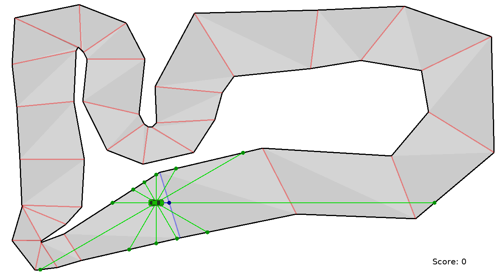

# Racing AI

Reinforcement learning in a basic car racing game.



## Installation

Install in editable move using a pip venv:

```sh
python3 -m venv venv
. venv/bin/activate
pip install -e .
```

## Usage

To launch the racing game GUI:

```sh
python -m racing_ai
```

To start the training pipeline:

```sh
python -m racing_ai.ml
```
